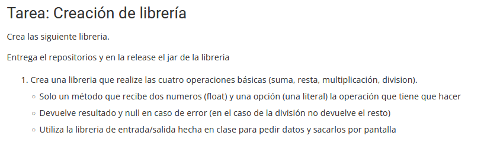
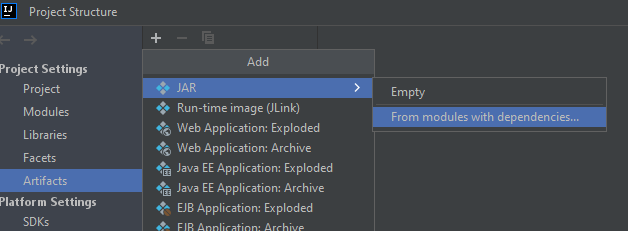
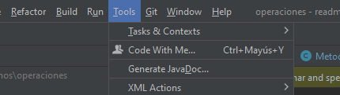

# Creación de librería


-----
## Solución planteada
### Importo libreria Entrad/Salida
Cloné el repositorio [teoriaLibreria](https://github.com/acastineiraduran/teoriaLibreria.git)
y la importé al proyecto _operaciones_ 
para utilizar sus metodos. Los pasos a seguir
fueron:
1. Creo el _.jar_
    ```mermaid
    flowchart LR
        F(File) --> PS(Proyect Structure) --> Artifacts --> +
    ```
    

    A continuación escogo el proyecto para hacer el _.jar_

2. Contruyo el artifact

    _Build-->Build Artifacts..._

3. Importo la librería

    Vuelvo a _Proyect Structure_ pero esta vez selecciono la opción de _Libreries_
    y añado el _.jar_ creado.

### Clase metodos
Hice un método que hiciera las operaciones pedidas en el ejercicio y devuelve 
`resultado` en caso de que no haya errores y `null` en caso de que sí los haya.

En la _Main_ recogo `resultado` o `null` en la variable `retultado`:
* Si el `resultado` es distinto de `null` entonces se imprimirá `resultado`.
* Si no, se informará al usuario de que hay un error en la operacion.
```java
Float resultado = obx.operacion(num1, num2, opcion);
if (resultado != null) { 
    if (Float.isNaN(resultado)) { 
        System.out.println("**ERROR: IMPOSIBLE DE CALULAR**");
    } else {
        System.out.println("resultado = " + resultado);
    }
} else {
    System.out.println("**ERROR EN OPERACION**");
}
```
También añadí un `if/else` anidado que imprima otro mensaje error en caso de que la
operación escogida devuelva un resultado imposible de calcular (NaN), como ocurre
en el caso de 0/0.

### Main
En la _Main_ reutilicé metodos de la librería importada. Debido a que no me quedó claro
cuántos y cuáles son los métodos que tenía que utilizar, intenté introducir todos
los que pude y en concreto aquellos que creé yo en clase con el fin hacer más práctica
la tarea. Doy está explicación, sobretodo, para explicar el _popurrí_ de `if/else`
anidados que creé y que pueden resultar no demasiado legibles.

Cómo sólo se podía hacer **un método**, para poder abarcar casi todas las alternativas
posibles, introduje bastante código en la _Main_...

### Documentacion de los metodos
1. Creo un directorio en el proyecto llamado _docs_.
2. Hago una descripcion de la clase, los metodos y los atributos.
3. Creo el _javadoc_ y lo meto en la carpeta creada.
  
    

### Fichero git ignore
1. Creé un fichero al mismo nivel que la _src_ que se llama _.gitignore_.
2. Añadí en el fichero todos aquellos archivos que no me interesan que se suban 
a GH.

### GH y release
1. Actualizo todos los cambios realizados.
2. Subo el _.jar_ de la libreria utilizada.
   1. creo etiqueta asociado al commit donde la importé.
      ```
      git tag -a v1.0 <ref-commit>
      ```
   2. Creo _release_ en GH y subo el _.jar_ 
3. Añado el _javadoc_.

# EXAMEN
## Primeros pasos - **rama master**
Hago un `git clone <enlace-repo-gh>` y hago el primer commit "INICIO EXAMEN"
agregando previamente unas cosas al _.gitignore_. Subo el commit a GH.
   > Este proceso lo hago como punto de partida de la tarea del examen

## Nueva rama - **rama raices**
1. Con `git branch raices` y con `git switch raices` creo una nueva rama y 
me muevo a ella. Añado y hago el primer commit "R1"
   ````
   git add .
   git commit -m "R1"
   ````
   Puedo hacer el `git add .` porque ya he agregado al fichero _.gitignore_
   todos los archivos que no me interesaban que se subieran a GH.
   
   Con `git log --oneline` compruebo que se ha subido correctamente.


2. En la clase _Metodos_ creo una nueva función para calcular la raiz cuadrada.
También descargo el _.jar_ de la realease del proyecto que es donde tengo la
libreria que he utilizado anteriormente. Para importarla:

   >_File --> Proyect Structure --> Libraries --> +_ 

   Agrego el _.jar_ correspondiente.


3. Añado y hago un nuevo commit "R2 - ..." con las nuevas opciones añadidas.

## Trabajo en el main - **rama raices**
1. Añado el metodo de calcular raiz a la _Main_
2. Como pedía el enunciado, el primer numero pedido corresponde al 
radicando y el segundo al indica.
3. Hago commit

## Squash - **rama master**
1. Hago un `git squash` de la rama raices posicionandome previamente en
la _Main_
2. Hago un nuevo commit indicando el squash

## Raiz para cualquier indice
1. Esto es solo una aclaración ya que al principio hice la funcion
de la raiz con el indice que quiera el ususario, por lo tanto puede ser
cuadrada, cúbica o la que quieras.

## Ultimos pasos
1. hago una etiqueta al ultimo commit
2. Creo un _.jar_
3. Hago una release en GH
4. Subo la etiqueta
5. Genero el javadoc
